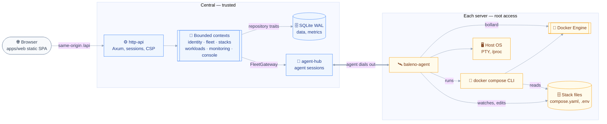

# INSTALL.md - Baleno

## 🎯 Vision

A self-hosted web interface to administer the Docker containers, Compose stacks, images and volumes of several servers.

Baleno drives VPS and bare-metal hosts from one central web app, through one agent per server that dials out to the central.
It groups containers by Compose project, the way OrbStack does, and adds real-time logs, container and host terminals, a file browser, and monitoring per container, per group and per host.
It is a personal open-source project under AGPL-3.0, single-user in v1, with a data model ready for multiple accounts and roles.

## ⚖️ Decisions

| Decision | Choice | Why |
| --- | --- | --- |
| Architecture | Modular monolith in one monorepo: one Rust crate per bounded context, binaries `baleno` (central) and `baleno-agent` (one per server), shared `agent-protocol` crate; dependency rule enforced by the crate graph | One developer, around 100 containers; boundaries checked by the compiler, not by discipline |
| Front-end | TanStack Start in SPA mode, served as a static shell by the central on the API origin; feature folders aligned with the backend contexts | Web dashboard, no SEO; no Node runtime in production; same structure and rules as artysan |
| Back-end | Rust: Axum, Tokio, SQLx; OpenAPI produced by utoipa, TypeScript client generated by Hey API and committed; agent drives Docker through bollard and stacks through the `docker compose` CLI | One contract source; the Engine API has no Compose endpoint |
| Database | SQLite in WAL mode, embedded in the central, for data and metrics | Single writer at about 10 inserts per second; nothing else to install, back up or upgrade |
| Auth | Hand-rolled in Rust: argon2id password, server-side sessions, TOTP planned, `users` table with a role from v1; agents enrolled by a one-time token, then a per-agent credential | No external auth service; multiple accounts later without a migration |
| Hosting | Central as one binary or Docker image, on one of the servers or a separate machine, behind TLS (built-in or reverse proxy), reachable over Internet, VPN or SSH tunnel; agent as a static binary under systemd or a container with the Docker socket | The user's own machines, no extra cost; no inbound port on the managed servers |
| Compose files | Each server's disk is the source of truth; the agent watches it; the central keeps the revision history of edits made through the UI | Existing stacks keep working from the shell; the central holds no `.env` secrets at rest |
| Licence | AGPL-3.0-only | A modified version offered over the network must publish its source |

### Engineering rules

| Rule | Statement |
| --- | --- |
| Priorities | Security and reliability first; security wins a conflict (fail closed); performance second; never over-engineer |
| Abstractions | A trait exists only when a second implementation is on the roadmap; exceptions: one repository trait per aggregate, implemented in `sqlite`, and `FleetGateway`, whose second implementation is the in-process fake agent used by context tests |
| Dependency rule | Adapters → contexts → `shared-kernel`; `baleno` depends on everything, for wiring only; `baleno-agent` → `agent-protocol` → `shared-kernel`; checked in CI with `cargo tree` |
| DDD dosage | Contexts hold `domain/` and `application/` modules only; no CQRS, no event sourcing, no crate per layer |
| Types | Illegal states unrepresentable: newtypes for ids (`ServerId`, `StackId`, `UserId`), typed container lifecycle; agent messages parsed once at the boundary |
| Reliability | Zero panics in production (`unwrap`, `expect`, `panic` denied by Clippy); `#![forbid(unsafe_code)]`; agents reconnect with backoff and resend their state |
| SQLite access | One writer connection, a separate reader pool, `BEGIN IMMEDIATE` for every write transaction; periodic Tokio tasks for downsampling, purge and backup, no job queue |
| Metrics | Raw samples every 10 seconds kept 24 hours, 1-minute aggregates kept 30 days |
| Backups | `VACUUM INTO` a temporary file, then rename |
| Tests | Real SQLite, no repository mocks; front: Vitest unit and Browser Mode, MSW, a few Playwright journeys with an axe pass |
| Observability | `tracing` with correlation ids from day 1; `Redacted<T>` in `shared-kernel`; no secrets, `.env` content or terminal input in logs |
| Front boundaries | Biome `noRestrictedImports` per folder, a feature never imports another; no global store; container output rendered as text spans, never HTML; strict CSP |
| Host shell | Spawned by the agent, never through SSH keys stored in the central; can be disabled per server |
| Licences | `cargo-deny` allowlist limited to AGPL-3.0-compatible licences |

## 🧱 Stack summary

- **Front-end:** `@tanstack/react-start` 1.168.60 (SPA mode), React, TanStack Router, Query, Form, Table and Virtual, Tailwind, shadcn on Base UI, Zod, i18next, Vite, Hey API 0.99.0 (exact pin), `anser` for ANSI, Biome, Knip, Vitest, MSW, Playwright, `@axe-core/playwright`; versions aligned on artysan. Terminal emulator library not chosen yet.
- **Back-end:** Rust (MSRV 1.94), Tokio 1.53.2, Axum 0.8.9, SQLx 0.9.0, utoipa 6.0.0, `utoipa-axum`, thiserror, `tracing`, cargo-nextest, cargo-deny.
- **Agent:** bollard 0.21.1, Docker Compose CLI v5.6.0, `portable-pty` 0.9.0, `docker-compose-types` 0.24.0 for tolerant parsing (the CLI stays authoritative).
- **Database:** SQLite in WAL mode, through SQLx.
- **Auth:** argon2id, server-side sessions in SQLite, HttpOnly, Secure and SameSite cookie, rotation at login, idle and absolute timeouts; TOTP planned.
- **Hosting:** the user's servers (3 to 5 at six months, 15 to 20 containers each); central and agent images or binaries built in CI for the servers' architectures.
- **Key integrations:** Docker Engine API through the local socket, Docker Compose CLI, moon, proto, pnpm, LeftHook, CommitLint.

## 🏗️ Architecture

The diagram shows the trust boundary between the central and each managed server, and the single link that crosses it.



The bounded contexts hold the business rules and know no framework; `http-api`, `sqlite` and `agent-hub` implement their ports, and `baleno` wires them together.
The agent opens the only link between the zones, an authenticated WebSocket to `agent-hub`, so managed servers expose no inbound port.
On each server the agent holds root-equivalent access through the Docker socket and the host shell, which makes agent enrolment and credentials the most sensitive part of the design.

## 📁 Folder structure

```text
baleno/
├── .moon/                      # workspace.yml, toolchains.yml, tasks/ (lint, format, test)
├── .github/workflows/ci.yml    # moon ci, client diff, dependency rule, cargo-deny, agent cross-builds
├── .claude/rules/              # artysan rules carried over
├── apps/web/                   # TanStack Start in SPA mode, served by the central
├── packages/api-client/        # Hey API output: client, Zod schemas, Query options (committed)
├── crates/                     # Cargo workspace, detailed below
├── deploy/                     # central Dockerfile, agent systemd unit + install script, compose example, reverse-proxy examples
├── aidd_docs/
├── Cargo.toml
├── rust-toolchain.toml
├── .prototools
├── pnpm-workspace.yaml
├── package.json
├── deny.toml                   # cargo-deny: AGPL-3.0-compatible licence allowlist, advisories
├── biome.json
├── knip.json
├── commitlint.config.ts
├── lefthook.yml
└── LICENSE                     # AGPL-3.0
```

```text
crates/
├── baleno/            # binary: central composition root, wires adapters into contexts
├── baleno-agent/      # binary on each server: Docker (bollard), compose CLI, PTY, host metrics, file access
├── shared-kernel/     # typed ids (ServerId, StackId, UserId), clock, error kinds, Redacted<T>
│   ── bounded contexts: domain + application, no I/O ──
├── identity/          # users, roles, sessions, password and TOTP rules
├── fleet/             # servers, agent enrolment and credentials, connection state; FleetGateway port
├── stacks/            # Compose projects, grouping, file revision history
├── workloads/         # container lifecycle, images, volumes
├── monitoring/        # samples, downsampling, 30-day retention, container/group/host queries
├── console/           # log streams, container and host terminals, file browser
│   ── adapters ──
├── http-api/          # Axum routes, utoipa, session cookie, browser WebSocket, static shell + CSP
├── sqlite/            # SQLx repositories, migrations, periodic jobs (downsampling, purge, backup)
├── agent-protocol/    # messages shared by the central and the agent, versioned
└── agent-hub/         # central side of the agent link; implements FleetGateway
```

```text
apps/web/src/
├── router.tsx
├── routes/
│   ├── __root.tsx
│   ├── login.tsx
│   ├── _app.tsx                # authenticated layout
│   └── _app/                   # index (fleet overview), servers/$serverId, stacks/$stackId,
│                               # containers/$containerId, images/, volumes/, settings/
├── features/                   # one folder per backend context; a feature never imports another
│   ├── identity/
│   ├── fleet/
│   ├── stacks/
│   ├── workloads/
│   ├── monitoring/
│   └── console/                # logs/ (ring buffer), terminal/, ansi/, files/
├── components/                 # shared UI; ui/ holds the owned shadcn primitives
├── lib/
└── test/                       # MSW handlers, factories
```

## 🛠️ Install steps

1. Initialise the Git repository with the AGPL-3.0 `LICENSE`, then pin the toolchains: Node and pnpm in `.prototools`, Rust 1.94 or later in `rust-toolchain.toml`.
2. Create the workspaces from the folder structure: moon, Cargo workspace with the lint table (`unsafe_code = "forbid"`, Clippy `unwrap_used`, `expect_used` and `panic` denied), pnpm workspace, LeftHook, CommitLint, Biome, Knip, and `deny.toml` with the AGPL-3.0-compatible allowlist; copy the artysan rules into `.claude/rules/`.
3. Run the spike before any feature: bollard `exec` with TTY resize, `portable-pty` session close and orphan processes, utoipa 6 output through Hey API 0.99, the `/_shell.html` fallback served by Axum, `BEGIN IMMEDIATE` through SQLx 0.9, and a SQLite load test of 100 containers sampled every 10 seconds with concurrent UI reads.
4. Prepare a test server with Docker Engine and the Compose plugin, and one real multi-container stack such as Louise (Mailpit, PostgreSQL, Garage).
5. Set up CI: `moon ci`, API client regeneration followed by `git diff --exit-code`, `cargo tree` dependency-rule check, `knip --cycles`, cargo-deny, agent builds for the servers' architectures, Playwright journeys with axe.
6. Before exposing the central on the Internet, settle agent enrolment and per-agent credentials, TLS (built-in or reverse proxy), session timeouts, and a scheduled `VACUUM INTO` backup with a tested restore.

## 🔍 Audit summary

| Area | Candidate | Verdict | Notes |
| --- | --- | --- | --- |
| Deployment | A, self-contained central with SQLite | ⚠️ | Chosen. SQLite WAL fits about 10 inserts per second; the SQLx deferred-transaction trap is handled by one writer and `BEGIN IMMEDIATE` |
| Deployment | B, central + PostgreSQL | ⚠️ | Viable; a second service to back up and upgrade for one user; `graphile_worker` 0.13.9 young, open regression #553 |
| Deployment | C, central + time-series database | ⚠️ | Oversized for about 1,000 series; VictoriaMetrics downsampling is enterprise-only; frequent security releases |
| Metrics storage | TimescaleDB | ❌ | Compression, continuous aggregates and retention policies sit under the Timescale License, a poor fit for an AGPL project |
| Job scheduling | apalis with SQLite | ❌ | `1.0.0-rc.11`; periodic Tokio tasks are enough |
| Front shell | TanStack Start SPA mode | ⚠️ | Chosen for parity with artysan; still a release candidate |
| Docker client | bollard 0.21.1 | ✅ | Streams for logs and stats, attached `exec` with input and output |
| Host terminal | `portable-pty` 0.9.0 | ⚠️ | Last release February 2025; open Unix close bugs |

| Unverified point | Check |
| --- | --- |
| CVE-2026-102989 (XSS) in TanStack Start, its impact on SPA mode and the fixed version | Open the advisory |
| `begin_with` available in SQLx 0.9.0 | docs.rs for `sqlx` 0.9.0, then the spike |
| utoipa 6.0.0 output accepted by Hey API 0.99.0 | The spike: `openapi.json` to generated client |
| SQLite throughput under the metrics load with concurrent reads | The spike load test |
| Agent credential mechanism (mTLS or signed key) | Design of the `fleet` context |
