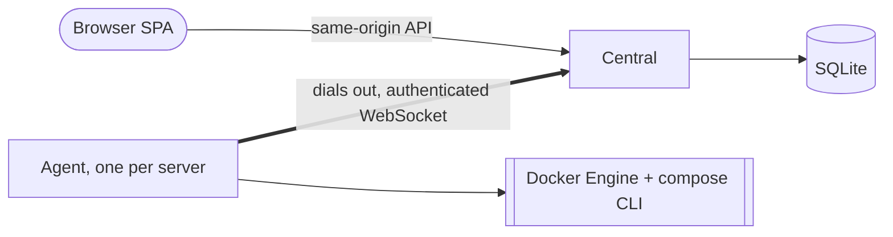

# Architecture

The full design and its rationale live in `aidd_docs/INSTALL.md`; this file keeps what every change must respect.

## Stack

- Back-end: Rust, Tokio, Axum, SQLx, utoipa for OpenAPI.
- Agent: Rust, bollard for the Docker Engine API, the `docker compose` CLI for stacks.
- Front-end: TanStack Start in SPA mode, React, TanStack Router/Query/Form, Tailwind, shadcn on Base UI; API client generated by Hey API from the OpenAPI output.
- Database: SQLite in WAL mode, embedded in the central.
- Monorepo tooling: moon, proto, Cargo workspace, pnpm workspace.

## How it fits together

## Key decisions

- Modular monolith: one Rust crate per bounded context, adapters implement their ports, the `baleno` binary only wires them.
- Dependency rule: adapters → contexts → `shared-kernel`; the agent depends only on the shared protocol and `shared-kernel`. Enforced by `scripts/check-dependency-rule.sh`.
- Managed servers expose no inbound port: the agent opens the only link.
- Priorities: security first and fail closed, reliability, then performance; never over-engineer.
- A trait exists only when a second implementation is planned (exceptions: one repository trait per aggregate, and `FleetGateway`).
- Contexts hold `domain/` and `application/` only: no CQRS, no event sourcing, no crate per layer.
- Illegal states unrepresentable: newtype ids (`crates/shared-kernel/src/ids.rs`), agent messages parsed once at the boundary.
- SQLite: one writer connection, a separate reader pool, `BEGIN IMMEDIATE` for every write; periodic Tokio tasks instead of a job queue.
- Each server's disk is the source of truth for Compose files; the central stores no `.env` secrets at rest.
- Secrets never reach logs: wrap them in `Redacted<T>` (`crates/shared-kernel/src/redacted.rs`).
- Container output is rendered as text, never HTML.

## Gotchas

- `unwrap`, `expect` and `panic` are denied by Clippy outside tests, and `unsafe` is forbidden (`Cargo.toml`, `clippy.toml`).
- A new dependency must carry a license from the `deny.toml` allowlist (AGPL-3.0-compatible only).
