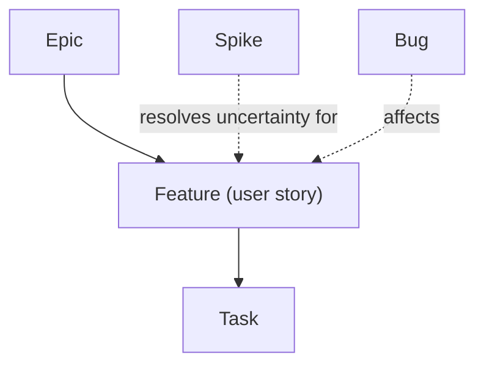

# Backlog

## Supports

| Support | Authority for | Role |
| --- | --- | --- |
| GitHub Issues | tickets, type, labels, relations | every work item, reached with `gh issue` |
| [GitHub Project](https://github.com/orgs/bryanbergerprojects/projects/10) | status, priority, size | board over the issues, reached with `gh project` |

## Structure

## Representation

| Artifact | Support | Native representation |
| --- | --- | --- |
| Epic | GitHub Issues | issue type `Epic` |
| User story | GitHub Issues | issue type `Feature` |
| Task | GitHub Issues | issue type `Task` |
| Spike | GitHub Issues | issue type `Spike` |
| Defect | GitHub Issues | issue type `Bug` |

## Workflow

| Support | Native status | Meaning |
| --- | --- | --- |
| GitHub Project | `Backlog` | captured, not refined |
| GitHub Project | `Ready` | refined, can start |
| GitHub Project | `In progress` | branch open, work underway |
| GitHub Project | `In review` | pull request open |
| GitHub Project | `Done` | merged or closed |

## Planning

- Priority: Project field `Priority`, `P0` (highest) to `P2`.
- Estimation: Project field `Size`, `XS` to `XL`.
- Roadmap: GitHub Milestones `M<n> · <name>`, in order, no due date; each issue belongs to one milestone. `M0` to `M6 · Release v0.1.0` reach v0.1.0.

## Relations

- Parent: GitHub sub-issues (Epic → Feature → Task).
- Dependency: GitHub native "blocked by" relationship between issues; the `❌ Blocked` label marks an external blocker.
